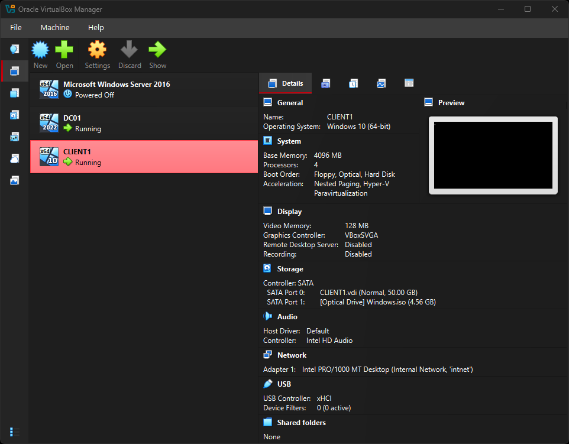
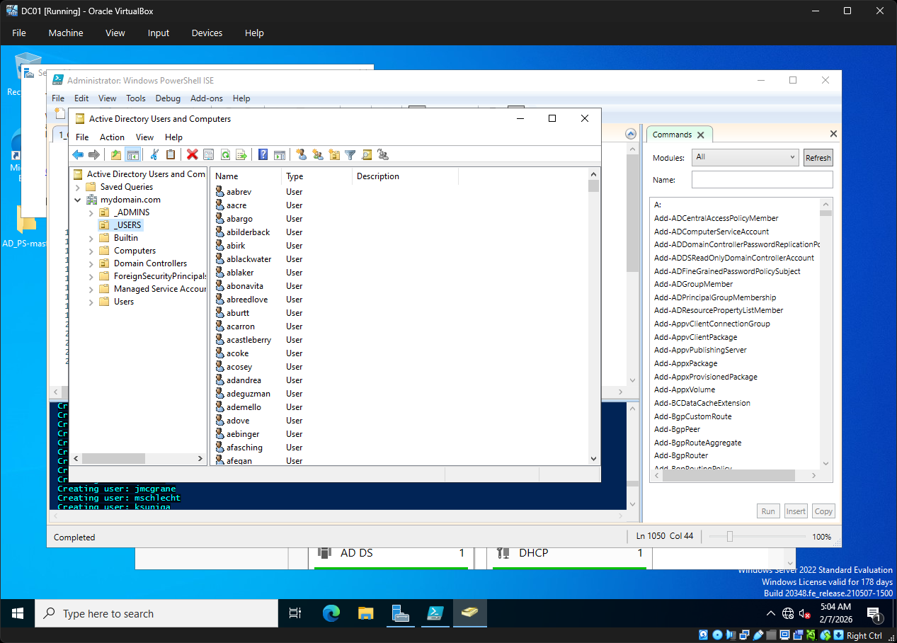
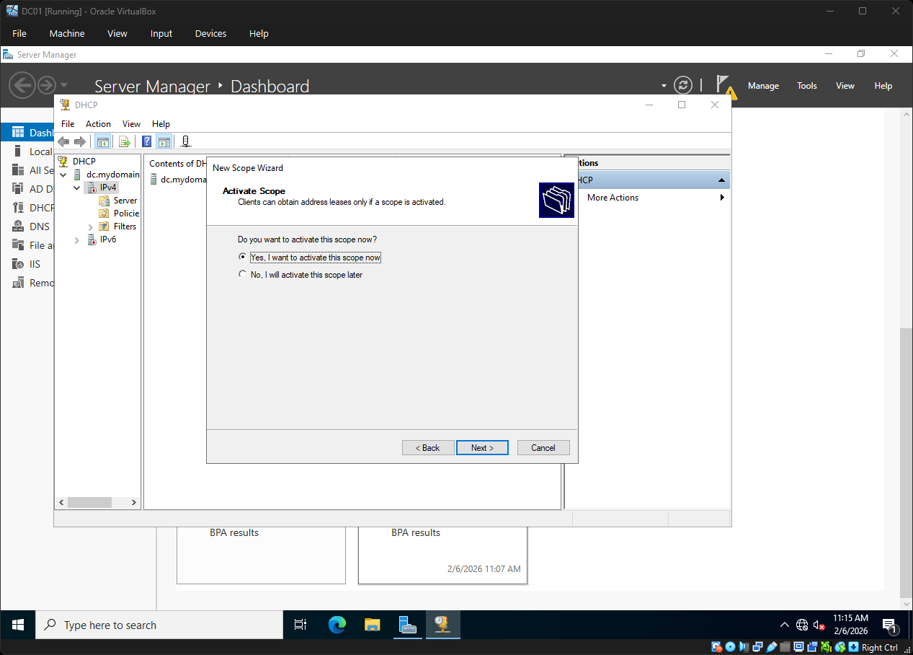
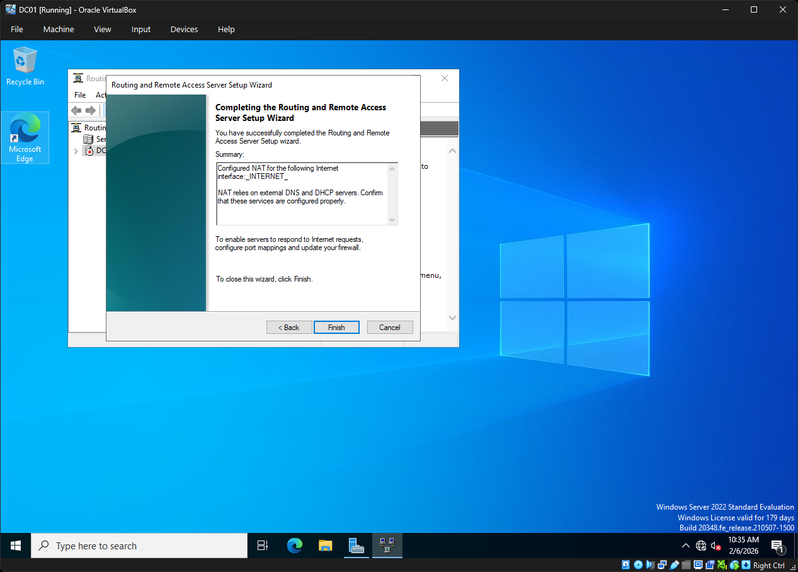
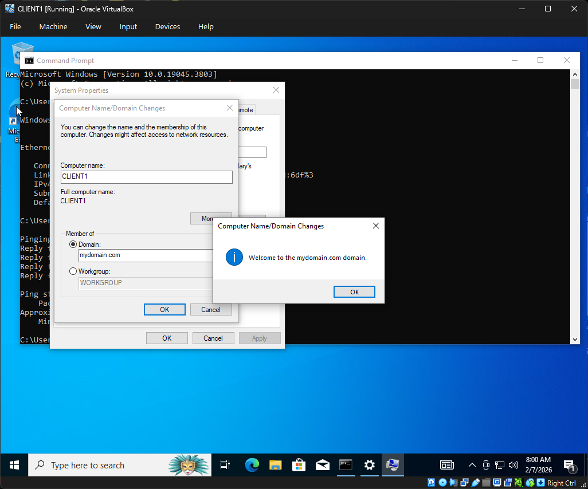
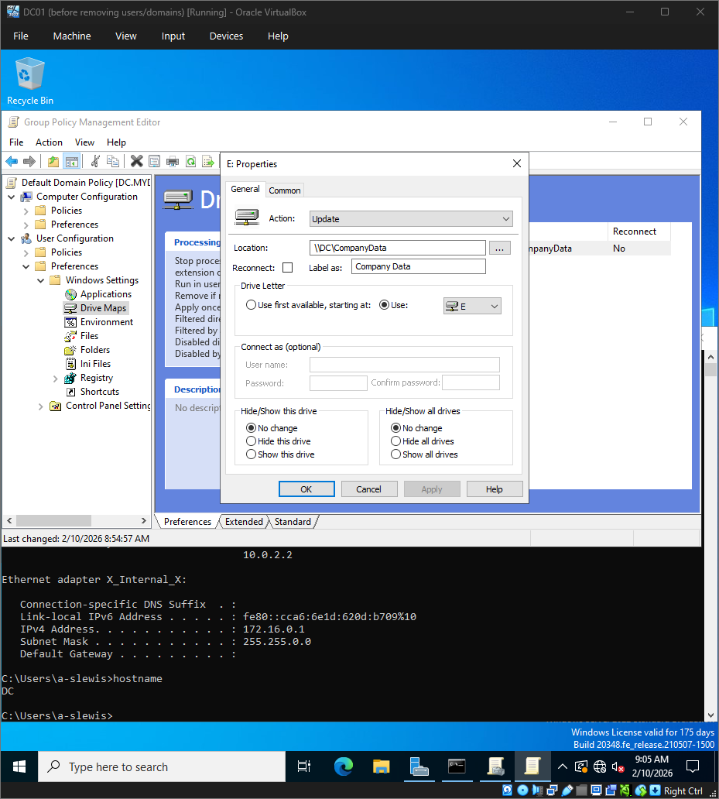
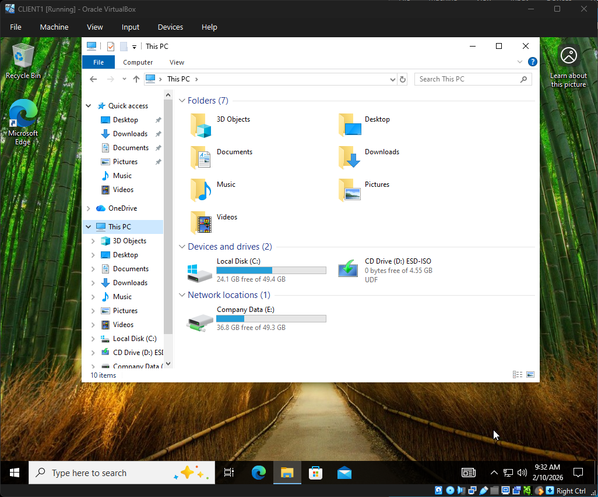
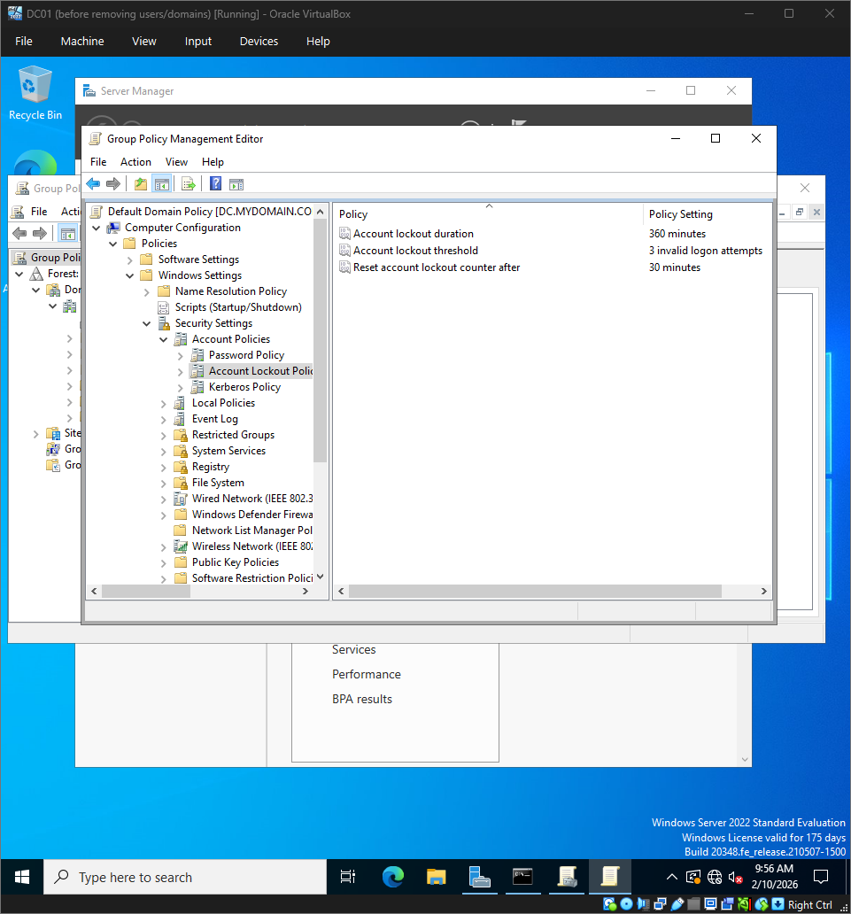
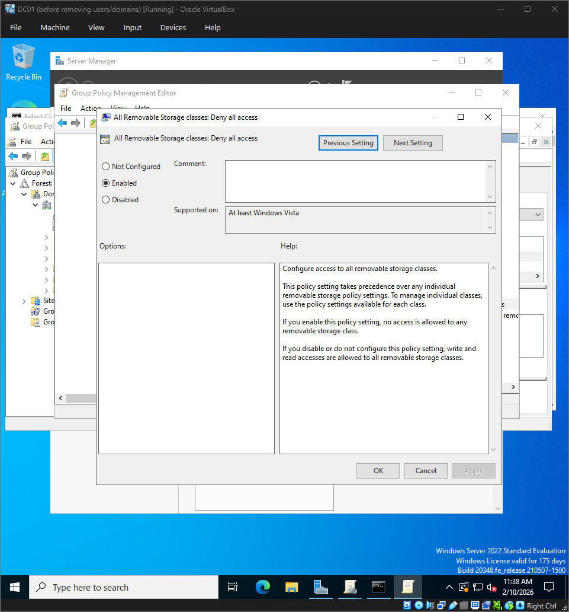

# Active Directory Home Lab (Windows Server 2022)

## Overview
This repository demonstrates an enterprise-style Windows Active Directory environment built in a home lab to practice real-world systems administration skills relevant to IT Specialist and SysAdmin roles.

## Lab Goals
- Build a Windows Server 2022 Domain Controller
- Configure internal networking for lab VMs
- Install and configure Active Directory Domain Services (AD DS)
- Configure DHCP for client IP assignment
- Configure RRAS/NAT for controlled internet access
- Join a Windows 10 client to the domain
- Create domain users using a PowerShell script to practice administrative automation (script not authored by me)

## Tools & Technologies

- Oracle VirtualBox (Virtualization)
- Windows Server 2022
- Active Directory Domain Services (AD DS)
- Group Policy Management (GPO)
- DHCP
- NTFS Permissions
- Windows 10 (Domain-Joined Client)
- PowerShell (User Provisioning Script)

## High-Level Steps
1. Install Windows Server 2022 and configure as Domain Controller
2. Configure virtual networking
3. Install AD DS and promote to Domain Controller
4. Configure RRAS/NAT
5. Configure DHCP scope
6. Create domain users (PowerShell)
7. Join CLIENT1 to the domain and validate access
8. Create and apply Group Policy Objects (GPOs) for security and access control
9. Validate drive mapping and permissions on CLIENT1

## Validation / Evidence
Screenshots are available in the `/screenshots` folder:
- VirtualBox overview DC01 and CLIENT1 
- AD Users & Computers showing created users 
- DHCP scope configuration 
- RRAS/NAT configuration 
- CLIENT1 domain join confirmation 
- CLIENT1 `ipconfig` output 
- NTFS permissions applied to shared folder 
- Group Policy drive mapping configuration 
- Mapped network drive visible on CLIENT1 
- Group Policy Account Lockout Policy configuration 
- Group Policy disabling USB storage on domain-joined workstations 

## What I Learned

- Implementing centralized identity and authentication using Active Directory
- Enforcing security controls through Group Policy
- Applying least-privilege access control using NTFS permissions
- Troubleshooting DNS, connectivity, and policy application issues

  
## Recent Enhancements
The lab was extended to include enterprise-style access control and user policy management:
- Implemented Group Policy Objects (GPOs) for:
  - Password policy enforcement
  - Network drive mapping using Group Policy Preferences
- Created and secured a shared network folder (`CompanyData`)
- Applied NTFS permissions following least-privilege access principles
- Validated successful GPO application on domain-joined client systems
- Configured Account Lockout Policy via Group Policy to mitigate brute-force login attempts

## Future Enhancements
- Create role-based access control using security groups
- Expand monitoring and logging for authentication and policy enforcement events

## Skills Demonstrated
- Windows Server 2022 administration
- Active Directory Domain Services (AD DS)
- Group Policy Object (GPO) management
- DHCP and internal network configuration
- NTFS permissions and access control
- Domain-joined client troubleshooting
- Enterprise-style user and resource management

